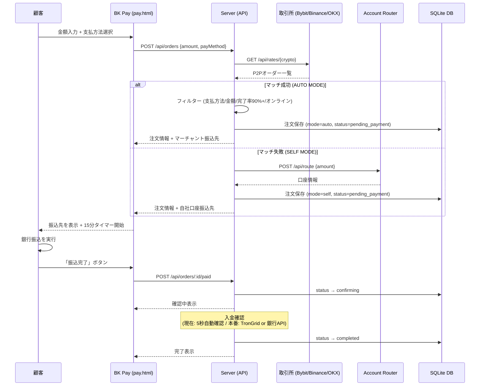
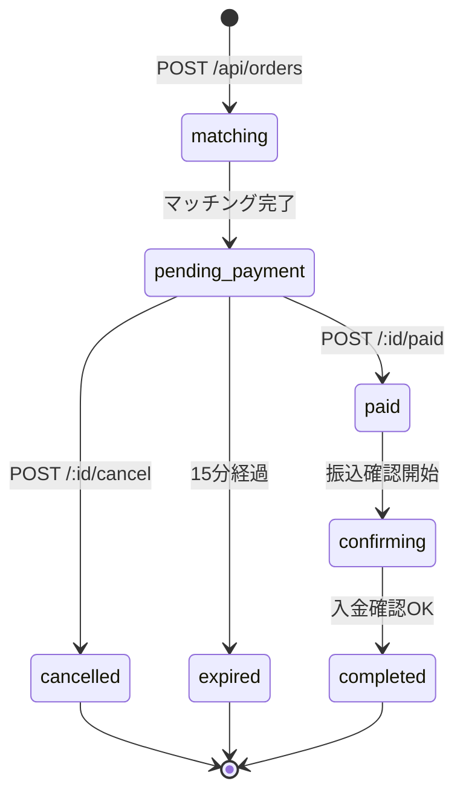
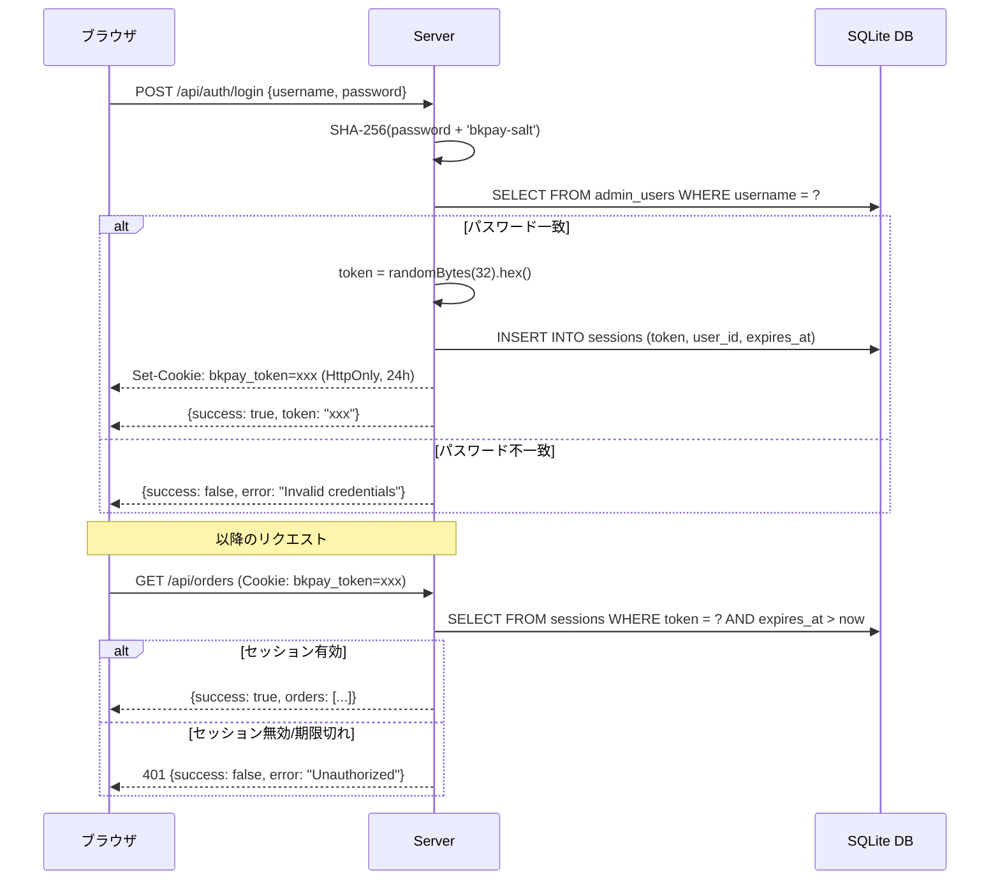
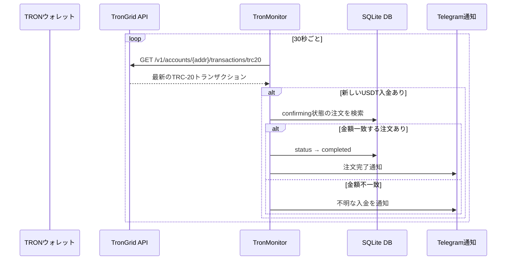
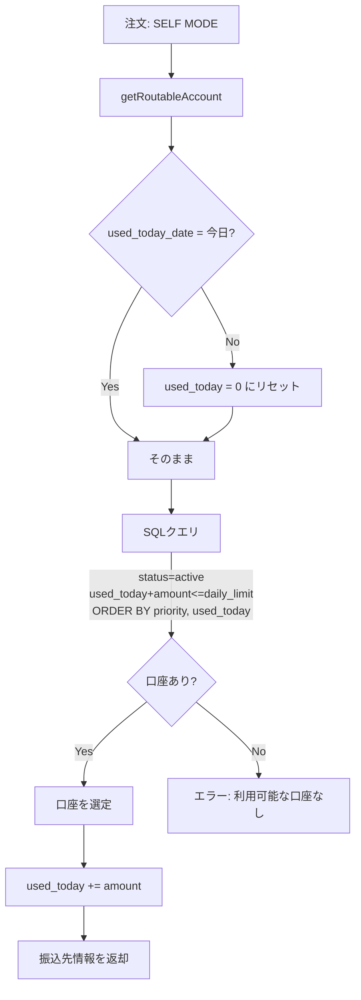

# BK P2P System — フロー図・状態遷移図

## 1. 注文フロー全体図



## 2. 注文ステータス遷移図



## 3. 認証フロー



## 4. レート更新フロー

```mermaid
flowchart TD
    A[30秒タイマー] --> B[Aggregator.updateAllCryptos]
    B --> C1[Bybit Fetcher]
    B --> C2[Binance Fetcher]
    B --> C3[OKX Fetcher]
    B --> C4[CoinGecko Spot]

    C1 --> D1[買いオーダー15件]
    C1 --> D2[売りオーダー15件]
    C2 --> D3[買いオーダー15件]
    C2 --> D4[売りオーダー15件]
    C3 --> D5[買いオーダー15件]
    C3 --> D6[売りオーダー15件]
    C4 --> D7[スポットレート]

    D1 & D2 & D3 & D4 & D5 & D6 --> E[乖離率フィルター]
    E --> |スポットから±15%超を除外| F[フィルター済みオーダー]

    F --> G[平均価格計算]
    F --> H[アービトラージ検出]
    F --> I[キャッシュに保存]

    I --> J[/api/rates で取得可能]
    J --> K[フロントエンドが30秒ごとにポーリング]
```

## 5. USDT着金検知フロー



## 6. 口座ローテーションフロー


